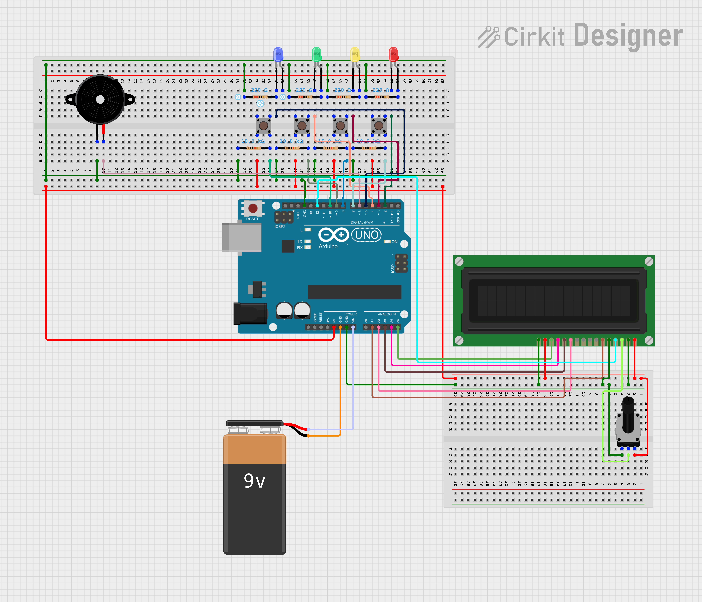

# Arduino Button Games
This is an Arduino project that I built from scratch. The project allows you to play a memory game where you must repeat the 
sequence of colours that are produced by the arduino. \
The other game is a reaction speed tester that sees how fast you can push a button after a light turns on, you can change the number of lights 
from 1 to 4 and see how your reaction times differ. \

# Build
First build the project based on the schematic \
Once built, upload the code in the [button_games](./button_games/button_games.ino) folder to your [Arduino Uno](https://store.arduino.cc/products/arduino-uno-rev3/)\
The final build could look something like this 

# TODO
Port the black jack game to the Arduino
